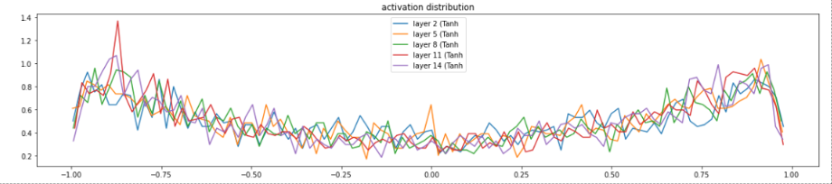
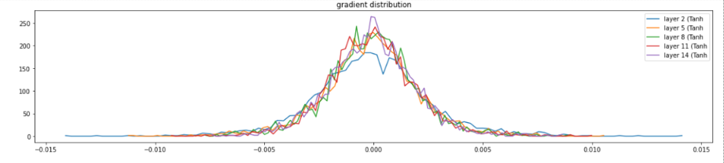
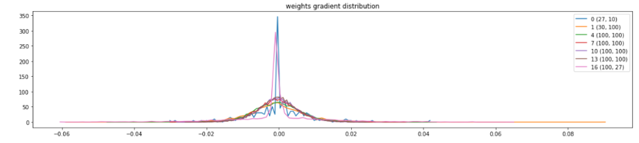
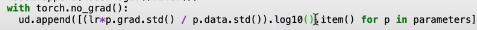
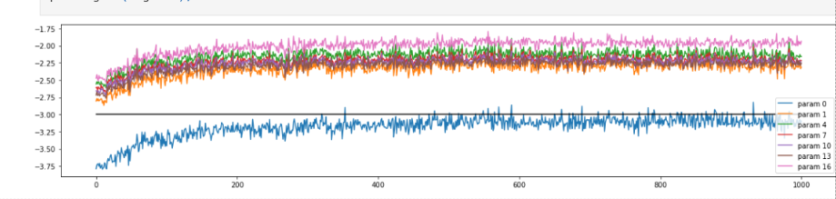

# How to ensure that training is working properly

Notes for: https://github.com/karpathy/nn-zero-to-hero/blob/master/lectures/makemore/makemore_part3_bn.ipynb

# Tanh activation visualisation
- In that, we first visualied the activation function after tanh. We need to ensure that the saturation(number of layers that gets the value 1 or -1 after tanh) is high on first layer, and gets smaller as layer proceeds. It ends by stabilising at around 5%.
- If we dont initialise properly(or batch normalise), this can get high or low, both of which is bad.

# Tanh gradients visualisation
- We need to ensure that all the layers have similar gradients - nothing is shrinking or exploding

# Grad:data ratio
- If it is big, it is bad. Has to be in range of 1e-3
- Not that important, the update:data ratio (given below) is more important

# Update:data ratio (V. important)

- Should be all roughly around 1e-3
- If it is below 1e-3, then the parameters are not being trained fast enough
- Can help you get to the correct value of learning rate.

